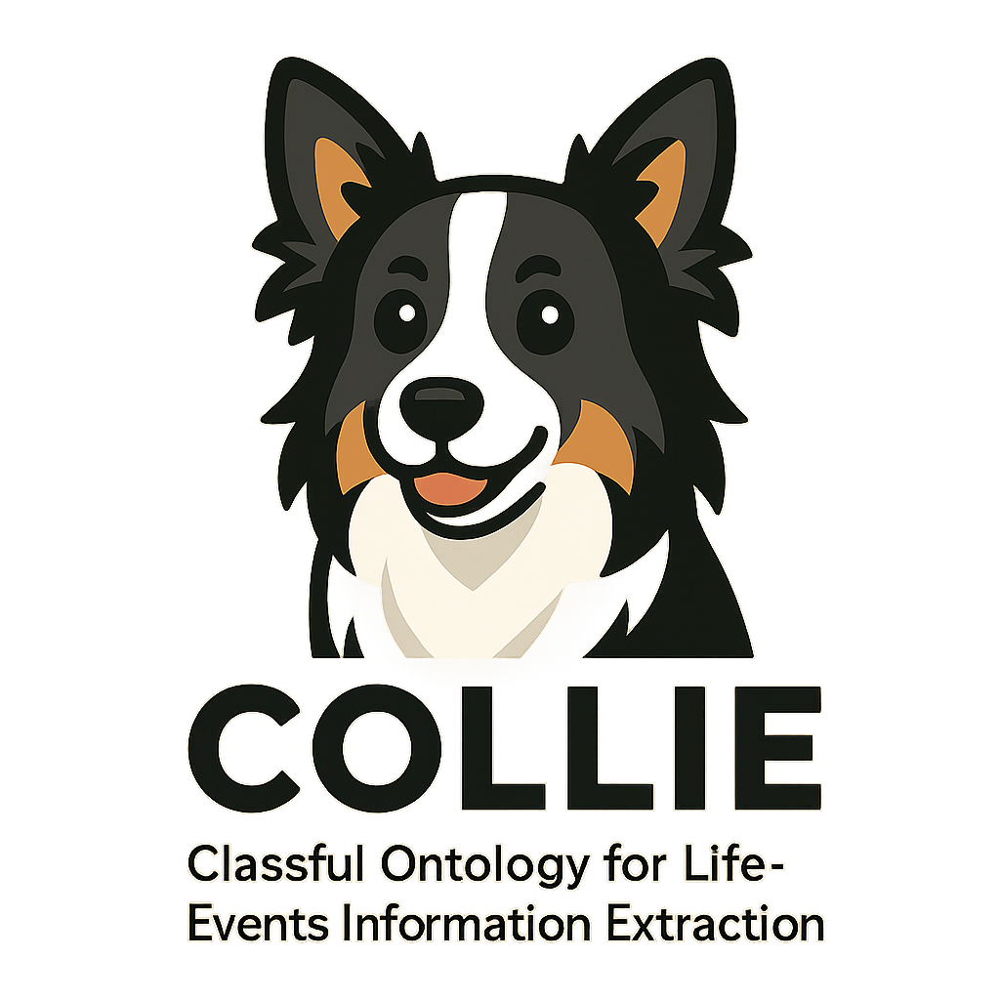

# COLLIE
Classful Ontology for Life-Events Information Extraction

## CIDOC CRM

The CIDOC Conceptual Reference Model (“CIDOC CRM”), a formal ontology intended to facilitate the integration, mediation and interchange of heterogeneous cultural heritage information and similar information from other domains.

### Objectives of the CIDOC CRM
The primary role of the CIDOC CRM is to enable the exchange and integration of information from heterogeneous sources for the reconstruction and interpretation of the past at a human scale, based on all kinds of material evidence, including texts, audio-visual material and oral tradition. It starts from, but is not limited to, the needs of museum documentation and research based on museum holdings. It aims at providing the semantic definitions and clarifications needed to transform disparate, localised information sources into a coherent global resource, be it within a larger institution, in intranets or on the Internet, and to make it available for scholarly interpretation and scientific evaluation. These goals determine the constructs and level of detail of the CIDOC CRM.

More specifically, it defines, in terms of a formal ontology, the underlying semantics of database schemata and structured documents used in the documentation of cultural heritage and scientific activities. In particular, it defines the semantics related to the study of the past and current state of our world, as it is characteristic for museums, but also or other cultural heritage institutions and disciplines. It does not define any of the terminology appearing typically as data in the respective data structures; it foresees, however, the characteristic relationships for its use. It does not aim at proposing what cultural heritage institutions should document. Rather, it explains the logic of what they actually currently document, and thereby enables semantic interoperability.

The CIDOC CRM intends, moreover, to provide a model of the intellectual structure of the respective kinds of mentioned documentation in logical terms. As such, it has not been optimised for implementation specific storage and processing factors. Actual system implementations may lead to solutions where elements and links between relevant elements of our conceptualizations are no longer explicit in a database or other structured storage system. For instance, the birth event that connects elements such as father, mother, birth date, birth place may not appear in the database, in order to save storage space or response time of the system. The CIDOC CRM provides a conceptual and technical means to explain how such apparently disparate entities are semantically and logically interconnected, and how the ability of the database to answer certain intellectual questions is affected by the omission of such elements and links.

The CIDOC CRM aims to support the following specific functionalities:

- Inform developers of information systems as a guide to good practice in conceptual modelling, in order to effectively structure and relate information assets of cultural documentation.
- Serve as a common language for domain experts and IT developers to formulate requirements and to agree on system functionalities with respect to the correct handling of cultural contents.
- To serve as a formal language for the identification of common information contents in different data formats; in particular, to support the implementation of automatic data transformation algorithms from local to global data structures without loss of meaning. The latter being useful for data exchange, data migration from legacy systems, data information integration and mediation of heterogeneous sources.
- To support associative queries against integrated resources by providing a global model of the basic classes and their associations to formulate such queries.
- It is further believed that advanced natural language algorithms and case-specific heuristics can take significant advantage of the CIDOC CRM to resolve free text information into a formal logical form, if that is regarded beneficial. The CIDOC CRM is not thought, however, to be a means to replace scholarly text, rich in meaning, by logical forms, but only a means to identify related data.

Users of the CIDOC CRM should be aware that the definition of data entry systems requires support of community-specific terminology, guidance to what should be documented and in which sequence, and application-specific consistency controls. The CIDOC CRM does not provide such notions.

By its very structure and formalism, the CIDOC CRM is extensible and users are encouraged to create extensions for the needs of more specialized communities and applications.

## pydantic

## labeled propergy graph support (Cypher/GQL)

